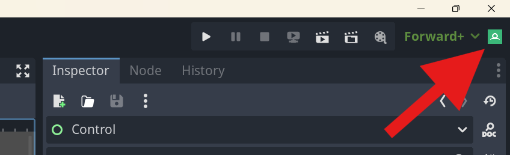
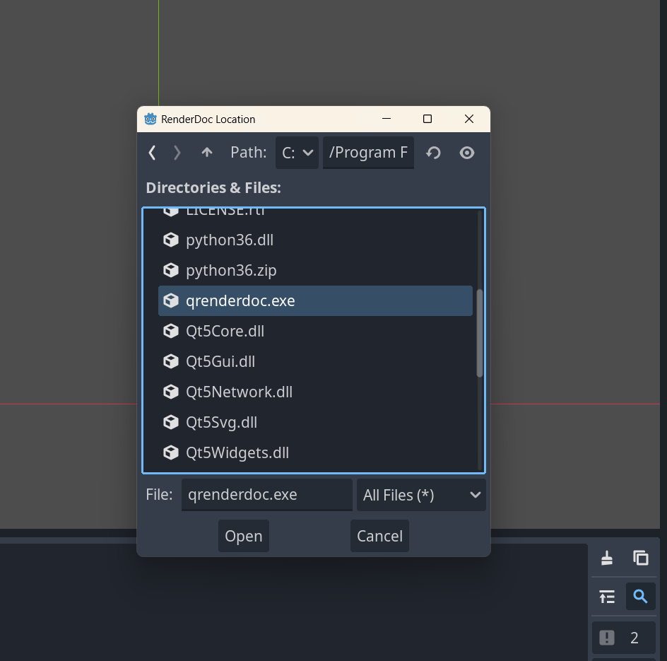
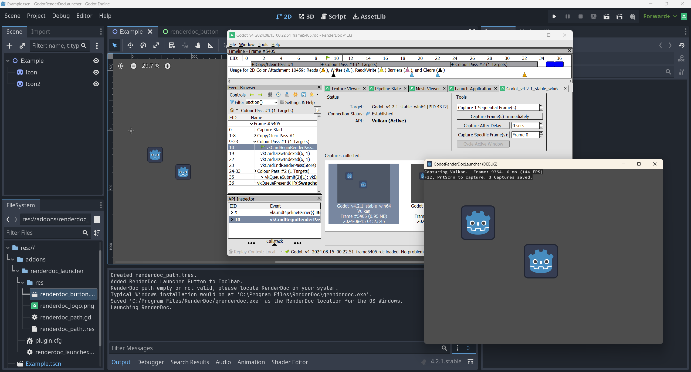

# GodotRenderDocLauncher

This plugin tool adds a button to Godot's editor allowing you to easily launch [RenderDoc](https://renderdoc.org/) so you can quickly see how your changes are affecting the game's rendering.

Works with Godot 3.5 and 4.x.

## Motivation

When developing a game, it is always important to be mindful of its performance. This can be measured in a few areas, namely rendering.

Especially when working with an engine like Godot or Unity, one might not be fully aware of the impact of actions such as adding that extra Node or GameObject, changing up the SceneTree or Hierarchy in a certain way, etc.

How do these actions translate to the engine’s renderer and ultimately, API calls?

[RenderDoc](https://renderdoc.org/) is a tool which can help us with that.

Not only can it help us identify bottlenecks in our scene, it can also serve as debugger to check the state of pipeline when looking for what went wrong drawing that piece of custom geometry.

I created this plugin to simplify my workflow when using RenderDoc.

Previously, I had to export my game and adjust RenderDoc's settings each time I made a change, which was tedious. I later discovered that I could directly launch a Godot project with the command-line argument "--path <path_to_your_project>" instead of having to export the game's executable, which made things easier. 

However, I still wanted quicker access to RenderDoc without having to navigate through multiple menus or search for file paths.

## Walkthrough

On project startup a button is added to the toolbar. Click this button to launch RenderDoc.

The first time you click the button you will be prompted to provide RenderDoc's location. This will be saved to a resource file so you do not need to do it again.

*For Windows this would typically be if the* `C:\\Program Files\\RenderDoc\\qrenderdoc.exe installer` *was used.*

After you provide RenderDoc's location, it will be launched and the game will automatically start. This and other settings can be found at `addons/renderdoc_launcher/res/default_settings.cap`. Edit this file according to your needs.

These settings are copied into `addons/renderdoc_launcher/res/settings.cap` for the actual launch.

**Notes:**  `addons/renderdoc_launcher/res/renderdoc_path.tres` which is where the path to RenderDoc is saved is in the `.gitignore` of the addon.
This is the default because if you are working with other people on a project, your RenderDoc locations will differ. Same logic applies for the settings, but the default ones.

If working on a project alone, feel free to remove the `.gitignore`, the path Resource even supports multiple OSs if you do test your project on multiple of them.

---

Hope this small tool can make your life easier when optimizing and iterating :)
